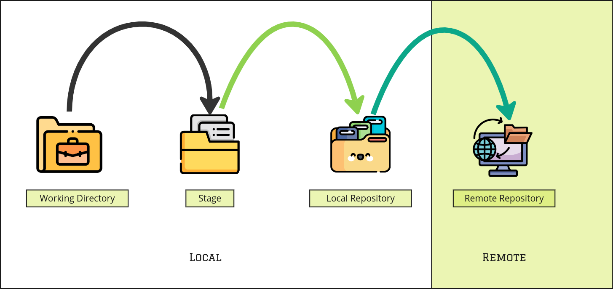

# Git Documentation

## Table of Contents
1. [Introduction](#introduction)
2. [Installing Git](#Installing-Git)
3. [Basic Git Commands](#Basic-Git-Commands)
4. [Staging in Git](#Staging-in-Git)
5. [Committing in Git](#Committing-in-Git)
6. [Git Reset](#git-reset)
7. [Removing Files in Git](#Removing-Files-in-Git)
8. [Branches in Git](#Branches-in-Git)
9. [Pushing to Remote in Git](#Pushing-to-Remote-in-Git)
10. [Pulling from Remote in Git](#Pulling-from-Remote-in-Git)
11. [Fetching Changes in Git](#Fetching-Changes-Git)
12. [Merging and Rebasing in Git](#Merging-and-Rebasing-in-Git)
13. [Stashing in Git](#Stashing-in-Git)
14. [Viewing Logs in Git](#Viewing-Logs-in-Git)
15. [Git Best Practices](#Git-Best-Practices)
16. [Resources](#Resources)

---
## Introduction
Git is a distributed version control system used to track changes in source code. It helps developers collaborate efficiently and manage code versions effectively.

### Why Use Git?
- Tracks changes efficiently.
- Enables team collaboration.
- Provides a reliable backup of code.
- Supports branching and merging for effective workflow.

---


## Installing Git
### Windows
1. Download from [git-scm.com](https://git-scm.com/downloads).
2. Run the installer and follow the instructions.
3. Verify installation with:
   ```sh
   git --version
   ```

### macOS
1. Install using Homebrew:
   ```sh
   brew install git
   ```
2. Verify installation:
   ```sh
   git --version
   ```

### Linux
1. Install via package manager:
   ```sh
   sudo apt install git  # Debian-based
   sudo yum install git  # RedHat-based
   ```
2. Verify installation:
   ```sh
   git --version
   ```

---
## Basic Git Commands
### Configure Git
```sh
git config --global user.name "Your Name"
git config --global user.email "your.email@example.com"
```

### Initialize a Repository
```sh
git init
```

### Clone a Repository
```sh
git clone <repository_url>
```

### Check Status
```sh
git status
```
---
## Staging in Git

Staging in Git is the process of adding changes to the index (staging area) before committing them. It allows you to review and selectively commit changes, ensuring a clean and structured commit history.

### Understanding Staging
- When you modify a file, it remains in the working directory.
- Running `git add` moves the file to the staging area.
- Committing the changes with `git commit` saves the staged changes to the repository.

---

### Staging Commands

#### 1. Add a Specific File to Staging
To stage a single file:
```sh
git add <file>
```

#### 2. Add Multiple Files
To stage multiple files at once:
```sh
git add <file1> <file2> <file3>
```

#### 3. Add All Changes in the Repository
To stage all modified and new files:
```sh
git add .
```
- Stages all changes (new, modified, deleted) in the current directory and subdirectories.

#### 4. Add All Tracked Files
To stage only modified and deleted files (ignoring untracked files):
```sh
git add -u
```

#### 5. Add All Files Including Untracked
To stage all files, including new (untracked) files:
```sh
git add -A
```
This is equivalent to:
```sh
git add . && git add -u
```

#### 6. Use Wildcards to Stage Files
To add files matching a pattern:
```sh
git add *.txt
```
- This adds all `.txt` files in the current directory.

---

### Checking Staged Files
To check which files are staged, run:
```sh
git status
```
- Files in the "Changes to be committed" section are staged.

---

### Removing a File from Staging
To unstage a file before committing:
```sh
git reset <file>
```
- This removes the file from the staging area but keeps changes in the working directory.

To unstage all files:
```sh
git reset
```
---
## Committing in Git

Committing in Git is the process of saving staged changes to the repository. A commit creates a new snapshot of the project, allowing you to track and manage changes effectively.

### Understanding Commits
- A commit saves the changes that are currently staged.
- Each commit has a unique identifier (SHA-1 hash).
- A commit should have a meaningful message describing the changes.

---

### Committing Commands

#### 1. Commit Staged Changes with a Message
To commit all staged files:
```sh
git commit -m "Your commit message"
```
- The message should clearly describe the changes made.

#### 2. Commit with a Multi-line Message
To write a detailed commit message:
```sh
git commit
```
- This opens a text editor where you can write a detailed message.

#### 3. Amend the Last Commit
To modify the most recent commit (useful for fixing mistakes):
```sh
git commit --amend -m "Updated commit message"
```
- This updates the last commit without creating a new one.
- **Note**: Avoid using this if the commit has already been pushed.

#### 4. Commit All Changes (Skip Staging)
To commit all modified and deleted files directly:
```sh
git commit -a -m "Commit message"
```
- This includes all tracked files but does not add new (untracked) files.

#### 5. Commit Only Specific Changes
To commit only a part of the changes in a file:
```sh
git commit -p
```
- This allows you to review and choose which changes to commit interactively.

---

### Checking Commit History
To view commit history:
```sh
git log
```
- Displays a list of commits with their messages and SHA hashes.

To view a condensed one-line commit history:
```sh
git log --oneline
```

To view the history of a specific file:
```sh
git log -- <file>
```

---

### Undoing a Commit
#### 1. Revert a Commit
To create a new commit that undoes a previous commit:
```sh
git revert <commit_hash>
```
- This is a safe way to undo a commit while keeping history intact.

#### 2. Reset a Commit (Move HEAD)
To undo the last commit but keep changes:
```sh
git reset --soft HEAD~1
```
- The changes remain staged.

To undo the last commit and unstage changes:
```sh
git reset --mixed HEAD~1
```

To undo the last commit and delete all changes:
```sh
git reset --hard HEAD~1
```
**Warning**: This removes changes permanently.
---
## Git Reset

Git reset is a powerful command used to undo changes by moving the HEAD reference and optionally modifying the staging area and working directory. It is useful for undoing commits, unstaging files, and reverting to a previous state.
### Resetting in Different Scenarios
---

#### 1. Reset a Specific File after Staging
If you added a file to staging but haven't committed yet and want to unstage it:
```sh
git reset <file>
```
- This removes the file from the staging area but keeps the changes in the working directory.

---
#### 2. Reset after Commit  
##### Understanding Git Reset

The `git reset` command has three primary modes on commit stage:

1. **Soft Reset** (`--soft`): Moves the HEAD to a previous commit while keeping changes staged.
2. **Mixed Reset** (`--mixed`): Moves the HEAD to a previous commit and unstages the changes, but keeps them in the working directory.
3. **Hard Reset** (`--hard`): Moves the HEAD to a previous commit and removes all changes permanently.

If you want to undo the last commit but keep the changes:

- **Soft Reset** (Keeps changes staged)
  ```sh
  git reset --soft HEAD~1
  ```
  - Moves HEAD back by one commit.
  - Keeps the changes in the staging area.

- **Mixed Reset** (Keeps changes but unstages them)
  ```sh
  git reset --mixed HEAD~1
  ```
  - Moves HEAD back by one commit.
  - Unstages the changes but keeps them in the working directory.

- **Hard Reset** (Removes changes permanently)
  ```sh
  git reset --hard HEAD~1
  ```
  - Moves HEAD back by one commit.
  - Deletes all uncommitted changes permanently.

---
**Reset to a Specific Commit**
- To reset the repository to an earlier commit:
    ```sh
    git reset --soft <commit_hash>
    ```
- Moves HEAD to `<commit_hash>` but keeps the changes staged.
    
    ```sh
    git reset --mixed <commit_hash>
    ```
- Moves HEAD to `<commit_hash>` and unstages the changes.
    
    ```sh
    git reset --hard <commit_hash>
    ```
- Moves HEAD to `<commit_hash>` and removes all changes beyond that commit.

---

#### 3. Undo a Reset
If you accidentally reset, you can find the previous commit hash using:
```sh
git reflog
```
Then, restore it using:
```sh
git reset --hard <previous_commit_hash>
```

### When to Use Git Reset?
- **Soft Reset**: If you want to modify the last commit without losing changes.
- **Mixed Reset**: If you want to remove commits but keep the changes for further modifications.
- **Hard Reset**: If you want a clean slate and remove all changes permanently.
---

## Removing Files in Git

Removing files in Git involves deleting them from the working directory, staging area, or history while maintaining version control. Depending on the scenario, you can remove files safely or permanently.

### Understanding File Removal
- `git rm` is used to remove tracked files.
- `git reset` can be used to unstage a file without deleting it.
- `git restore` can be used to recover deleted files before committing.

---

### Removing Files from Git

#### 1. Remove a File from Git and the Working Directory
To remove a file from Git and the local directory:
```sh
git rm <file>
```
- This deletes the file and stages the removal.
- Requires a commit to finalize the removal.

#### 2. Remove a File from Git but Keep It Locally
To untrack a file without deleting it from the local directory:
```sh
git rm --cached <file>
```
- The file remains in the working directory but is no longer tracked by Git.

#### 3. Remove a Folder Recursively
To remove a folder and all its contents:
```sh
git rm -r <folder>
```
- This removes the folder and all files inside it.

---

### Undoing File Removal
#### 1. Restore a Deleted File Before Committing
If you deleted a file but haven't committed yet:
```sh
git restore <file>
```
- This restores the file from the last commit.

#### 2. Recover a File After Committing
If you committed the deletion but need the file back:
```sh
git checkout HEAD~1 -- <file>
```
- This restores the file from the previous commit.

---


### When to Use Git Remove?
- Use `git rm` to remove files from Git tracking.
- Use `git rm --cached` to keep files locally but remove from tracking.
- Use `git restore` to recover deleted files before committing.
---
## Branches in Git

Branches in Git allow you to work on different versions of a project simultaneously. They enable parallel development, experimentation, and collaboration without affecting the main codebase.

### Understanding Branches
- **Main Branch (Default):** The `main` or `master` branch is the primary development branch.
- **Feature Branches:** Used for developing new features without affecting the main branch.
- **Bugfix Branches:** Created to fix issues and merged back into the main branch after resolution.
- **Release Branches:** Used for preparing a stable release while keeping development active in other branches.

---

### Managing Branches

#### 1. List All Branches
To display all local branches:
```sh
git branch
```
To list both local and remote branches:
```sh
git branch -a
```

#### 2. Create a New Branch
To create a new branch:
```sh
git branch <branch_name>
```

#### 3. Switch to Another Branch
To switch to an existing branch:
```sh
git checkout <branch_name>
```
Or using the newer syntax:
```sh
git switch <branch_name>
```

#### 4. Create and Switch to a New Branch
To create a new branch and switch to it immediately:
```sh
git checkout -b <branch_name>
```
Or:
```sh
git switch -c <branch_name>
```

#### 5. Rename a Branch
To rename the current branch:
```sh
git branch -m <new_branch_name>
```

#### 6. Delete a Branch
To delete a local branch:
```sh
git branch -d <branch_name>
```
To force delete a branch:
```sh
git branch -D <branch_name>
```
To delete a remote branch:
```sh
git push origin --delete <branch_name>
```

---

### Merging Branches
#### 1. Merge a Branch into the Current Branch
To merge changes from another branch:
```sh
git merge <branch_name>
```
- **Fast-forward merge:** When there are no diverging changes, Git moves the branch pointer forward.
- **Recursive merge:** If changes exist on both branches, Git tries to merge them automatically.

#### 2. Resolve Merge Conflicts
If conflicts occur during a merge:
1. Git will mark the conflicting files.
2. Open the files and resolve the conflicts manually.
3. After resolving conflicts, stage the changes:
   ```sh
   git add <resolved_file>
   ```
4. Complete the merge with:
   ```sh
   git commit
   ```

---

### Rebasing a Branch
Rebasing is an alternative to merging that moves the branch to the latest commit of another branch.
```sh
git rebase <branch_name>
```
- Used to keep a clean commit history.
- Avoid rebasing shared branches to prevent history conflicts.

---

### Tracking Remote Branches
#### 1. Fetch Remote Branches
To retrieve updates without merging:
```sh
git fetch origin
```

#### 2. Checkout a Remote Branch Locally
To create a local branch tracking a remote branch:
```sh
git checkout -b <branch_name> origin/<branch_name>
```
Or using:
```sh
git switch --track origin/<branch_name>
```

#### 3. Push a New Local Branch to Remote
To publish a local branch:
```sh
git push -u origin <branch_name>
```

---

##### When to Use Branches?
- **Feature development**: Work on new features without disturbing the main branch.
- **Bug fixes**: Quickly fix and test issues in a separate branch.
- **Code reviews**: Use branches for reviewing and improving code collaboratively.
- **Release management**: Maintain separate release branches for production stability.
---

## Pushing to Remote in Git

Pushing in Git means uploading local branch changes to a remote repository. This ensures that your work is shared and synchronized with others.

### Understanding Git Push
- `git push` sends committed changes to a remote repository.
- Requires setting up a remote repository (e.g., GitHub, GitLab, Bitbucket).
- You must have the correct permissions to push changes.

---

### Pushing Changes to Remote

#### 1. Push a Branch for the First Time
If you have a new branch and want to push it to remote:
```sh
git push -u origin <branch_name>
```
- The `-u` (or `--set-upstream`) option sets up tracking for the branch.
- Future pushes can be done with `git push` alone.

#### 2. Push Changes to an Existing Branch
If your branch is already linked to a remote branch:
```sh
git push
```
- This pushes commits from the current branch to its remote counterpart.

#### 3. Push All Branches
To push all local branches to remote:
```sh
git push --all origin
```

#### 4. Push Tags to Remote
To push local tags to remote:
```sh
git push --tags
```

---

### Force Pushing
#### 1. Overwrite Remote Branch (Use with Caution)
If you need to overwrite remote changes:
```sh
git push --force
```
- **Warning:** This replaces remote changes and can cause data loss.
- Only use this if you're sure about removing previous remote commits.

#### 2. Safer Force Push
To prevent overwriting commits that others might have added:
```sh
git push --force-with-lease
```
- This ensures that no one else has pushed changes since your last fetch.

---

### Handling Push Issues
#### 1. Authentication Error
If you face authentication issues:
- Ensure you have the correct SSH keys or PAT (Personal Access Token) configured.
- Check repository permissions.

#### 2. Rejected Push Due to Outdated Local Branch
If you see an error like "rejected because the remote contains work that you do not have locally":
```sh
git pull --rebase
```
- This fetches and applies remote changes before pushing.

#### 3. Pushing to the Wrong Branch
To change the branch being pushed:
```sh
git push origin <correct_branch>
```

---

### When to Use Git Push?
- To share work with teammates.
- To back up local changes to a remote repository.
- To deploy changes when using Git-based CI/CD workflows.


---
## Pulling from Remote in Git

Pulling in Git updates your local branch with the latest changes from the remote repository. It ensures that your local work stays in sync with the latest version of the project.

### Pulling Changes from Remote

#### 1. Pull the Latest Changes
To update your current branch with the latest changes from the remote:
```sh
git pull origin <branch_name>
```
- Downloads new changes and merges them automatically into your local branch.

#### 2. Fetch Changes Without Merging
To download updates without automatically merging them:
```sh
git fetch origin
```
- This allows you to review the changes before merging.
- To manually merge the fetched updates:
```sh
git merge origin/<branch_name>
```

### When to Use Git Pull?
- To get the latest updates before making new changes.
- To stay in sync with other team members' work.
- Before pushing your own changes to avoid conflicts.


---
## Fetching Changes in Git

Fetching in Git downloads the latest changes from the remote repository but does not automatically merge them into your local branch. This allows you to review updates before applying them.

### Fetching Changes from Remote

#### 1. Fetch the Latest Changes
To download updates without merging them:
```sh
git fetch origin
```
- Downloads the latest commits and branches from the remote repository.
- Does not modify your working directory or current branch.

#### 2. Fetch a Specific Branch
To fetch changes from a specific branch:
```sh
git fetch origin <branch_name>
```
- This retrieves updates only for the specified branch without affecting your local copy.

#### 3. Check for New Changes
After fetching, check for updates before merging:
```sh
git status
```
- This shows if your local branch is behind the remote branch.

#### 4. Merge Fetched Changes
To manually merge fetched updates into your current branch:
```sh
git merge origin/<branch_name>
```
- This applies the fetched changes to your branch.

### When to Use Git Fetch?
- When you want to see remote updates before merging them.
- To keep your local repository updated without affecting your working branch.
- Before performing a pull to ensure you know what changes will be applied.

---
## Merging and Rebasing in Git

Merging and rebasing are two ways to integrate changes from one branch into another.

### Merging Changes
Merging combines changes from one branch into another while preserving the history of both branches.

#### 1. Merge a Branch into the Current Branch
```sh
git merge <branch_name>
```
- Combines `<branch_name>` into the current branch.
- Retains both commit histories.
- May create a merge commit if there are new changes on both branches.

#### 2. Handle Merge Conflicts
If conflicts occur during a merge:
1. Open the conflicting files and manually resolve the differences.
2. Stage the resolved files:
   ```sh
   git add <resolved_file>
   ```
3. Complete the merge:
   ```sh
   git commit
   ```

#### 3. Abort a Merge
To cancel an ongoing merge:
```sh
git merge --abort
```
- Restores the branch to its pre-merge state.

---

### Rebasing Changes
Rebasing moves a branch onto another branch’s latest changes, creating a cleaner commit history.

#### 1. Rebase a Branch onto Another Branch
```sh
git rebase <branch_name>
```
- Moves the current branch’s commits to the latest state of `<branch_name>`.
- Creates a linear history instead of a merge commit.

#### 2. Handle Rebase Conflicts
If conflicts occur during rebasing:
1. Resolve conflicts manually in the affected files.
2. Stage resolved files:
   ```sh
   git add <resolved_file>
   ```
3. Continue the rebase:
   ```sh
   git rebase --continue
   ```
4. To abort the rebase and return to the original state:
   ```sh
   git rebase --abort
   ```

---

### When to Use Merge vs. Rebase?
- **Use Merge** when you want to preserve the commit history and track how branches were combined.
- **Use Rebase** when you want a clean, linear history without merge commits.


---

## Stashing in Git

Stashing in Git allows you to temporarily save changes that you are not ready to commit. This is useful when you need to switch branches or pull updates without committing unfinished work.

### Stashing Changes

#### 1. Stash Uncommitted Changes
To save your current work without committing:
```sh
git stash
```
- This moves uncommitted changes to a stash and reverts the working directory to the last commit.

#### 2. Stash with a Custom Message
To add a description to the stash:
```sh
git stash save "My stash message"
```

#### 3. View Stashed Changes
To see all saved stashes:
```sh
git stash list
```

#### 4. Apply the Most Recent Stash
To bring back the last stashed changes:
```sh
git stash apply
```
- This applies the stash but does not remove it from the stash list.

#### 5. Apply and Remove a Stash
To apply and delete the stash at the same time:
```sh
git stash pop
```

#### 6. Apply a Specific Stash
To restore a specific stash from the list:
```sh
git stash apply stash@{n}
```
- Replace `{n}` with the stash number from `git stash list`.

#### 7. Delete a Specific Stash
To remove a stash from the list:
```sh
git stash drop stash@{n}
```

#### 8. Clear All Stashes
To delete all stashed changes:
```sh
git stash clear
```

### When to Use Git Stash?
- When switching branches without committing unfinished work.
- Before pulling changes to avoid merge conflicts.
- To temporarily save changes without creating a commit.


---
## Viewing Logs in Git

Git logs help track commit history, showing details like commit messages, authors, and timestamps. Logs are useful for understanding changes and debugging issues.

### Viewing Commit History

#### 1. Show All Commits
To display the commit history:
```sh
git log
```
- Lists commits in reverse chronological order.
- Shows commit hash, author, date, and message.

#### 2. Show a Compact Log
To see a one-line summary of each commit:
```sh
git log --oneline
```
- Displays a concise view of commit history.

#### 3. Show Commits for a Specific File
To see the commit history of a specific file:
```sh
git log -- <file>
```

#### 4. Show Commit History with Branch Information
To view a graphical representation of branches:
```sh
git log --oneline --graph --all --decorate
```
- Helps visualize branch merges and commit relationships.

### Filtering Log Output

#### 5. Show Commits by a Specific Author
To view commits made by a specific person:
```sh
git log --author="Author Name"
```

#### 6. Show Commits Within a Time Range
To see commits within a specific period:
```sh
git log --since="2 weeks ago"
```
```sh
git log --until="2024-01-01"
```

### When to Use Git Log?
- To track commit history and find specific changes.
- To debug issues and identify when a change was introduced.
- To review contributions from different authors.
---

## Git Best Practices
- Write clear commit messages.
- Keep commits small and focused.
- Use branches for feature development.
- Regularly pull the latest changes.
- Avoid force-pushing unless necessary.
---

## Resources
- [Official Git Documentation](https://git-scm.com/doc)
- [Pro Git Book](https://git-scm.com/book/en/v2)
